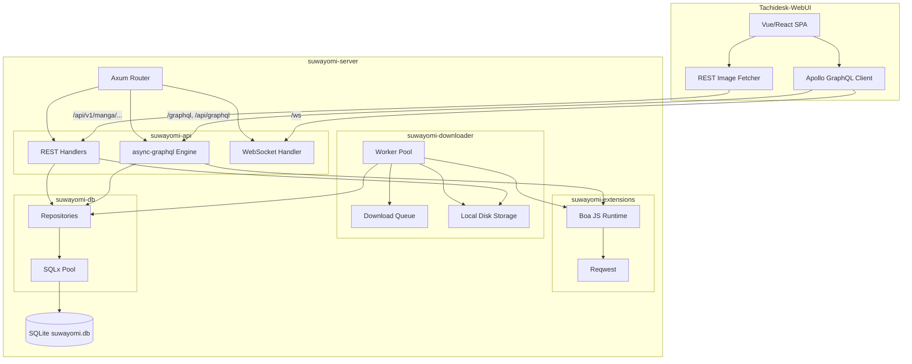

# Architectural Review: Original Suwayomi-Server & Tachidesk-WebUI vs suwayomi-rust

## 1. Introduction

This document provides an exhaustive architectural comparison between the original Suwayomi-Server (implemented in Kotlin/JVM) bundled with the Tachidesk-WebUI frontend (Apollo Client, Vue/React, r3518), and the current `suwayomi-rust` implementation. It outlines current crate coverage, field-level API differences, gap analysis, and a phased technical implementation blueprint.

## 2. Workspace Crate Coverage and Subsystem Mapping

The current Rust implementation is divided into 6 distinct Cargo workspace crates:

| Crate | Original Kotlin Subsystem | Current Rust Status |
| --- | --- | --- |
| `crates/suwayomi-core` | Core models, traits, enum classes | Basic models defined (`Manga`, `Chapter`, `Category`, `DownloadStatus`, `Filter`, `MangaSource` trait). |
| `crates/suwayomi-db` | SQLite Database, Expose/SqlDelight | Using `sqlx` (SQLite). Supports basic CRUD for Manga, Chapter, and Category. WAL mode and migrations are set up. |
| `crates/suwayomi-extensions` | JS/Dex2Jar Extension loading | Implemented a Boa JS engine runtime (`boa_engine`). Methods are mostly stubbed out returning "Not implemented" except for a mocked `get_popular_manga`. The original JVM backend used Dex2Jar for standard Tachiyomi APK extensions. |
| `crates/suwayomi-downloader` | DownloadManager, Worker threads | Basic queue and worker pool created. Local disk storage implemented. No WebSocket progress broadcasts yet. |
| `crates/suwayomi-api` | Ktor routing, GraphQL engine | Uses `axum` and `async-graphql`. GraphQL schema supports basic queries (`manga`, `library`, `chapters`, `categories`) and mutations (`update_chapter_read`, `create_category`, `delete_category`). Missing many queries expected by Apollo Client. |
| `crates/suwayomi-server` | Application Bootstrap (`Main.kt`) | Basic CLI with `clap`, handles DB pooling and Axum server initialization. Missing static file serving for WebUI via `rust-embed`. |

## 3. Web & API Layer Gap Analysis

The bundled Tachidesk-WebUI expects a specific API footprint which suwayomi-rust currently does not fully cover.

### Dual Endpoints
- **Expected:** `/api/graphql` and `/graphql`
- **Current:** Only `/graphql` is implemented. Needs routing alias for `/api/graphql`.

### GraphQL Types
- **Expected:** `MangaType`, `ChapterType`, `CategoryType`, etc.
- **Current:** Simple `Manga`, `Chapter`, `Category` types in `async-graphql`. Apollo might complain about missing fields or type name mismatches.

### GraphQL Queries
- **Expected:** `aboutServer`, `aboutWebUI`, `settings`, `metas`, `categories`, `mangas`, `manga`, `chapters`, `downloadStatus`
- **Current:** Only `manga`, `library`, `chapters`, `categories` are implemented.

### GraphQL Mutations
- **Expected:** Full suite of mutations for settings, chapter states, categories, and downloads.
- **Current:** Only `update_chapter_read`, `create_category`, `delete_category` exist.

### REST Routes
- **Expected:** `/api/v1/manga/:id/thumbnail`, `/api/v1/manga/:id/chapter/:id/page/:page`
- **Current:** Implemented `/api/v1/manga/:id`, `/api/v1/manga/:id/chapters`, `/api/v1/chapter/:id`, `/api/v1/category`. Missing the image serving REST routes completely.

## 4. Extensions Subsystem Gap Analysis

- **Original:** Loaded standard Android APK extensions using Dex2Jar to run Kotlin/Java extension code on the JVM.
- **Rust:** Uses `boa_engine` to parse JavaScript-based extensions.
- **Implementation Gap:** Most JS bindings (`get_latest_updates`, `search_manga`, `get_manga_details`, `get_chapter_list`, `get_page_list`) are hardcoded to return `Err("Not implemented")` in `crates/suwayomi-extensions/src/runtime.rs`.

## 5. Downloader Subsystem Gap Analysis

- **Original:** Robust thread-safe queue, disk storage layout matching Tachiyomi, worker pool, and real-time WebSocket progress notifications on `/ws`.
- **Rust:** A basic thread-safe queue (`queue.rs`) and storage layout (`storage.rs`) are present. The worker pool (`worker.rs`) fetches pages directly.
- **Implementation Gap:** `/ws` handler in `crates/suwayomi-api/src/ws.rs` is just an echo server. It needs to be hooked up to a `tokio::sync::broadcast` channel to stream real-time progress updates from the `DownloadQueue`.

## 6. Frontend Bundle Gap Analysis

- **Original:** Bundled the Tachidesk-WebUI SPA statically and served it at the root `/`.
- **Rust:** `suwayomi-server` currently doesn't serve the frontend.
- **Implementation Gap:** Needs `rust-embed` to pack the frontend UI assets and Axum routing to serve them on `/` and fallback to `index.html` for client-side routing.

## 7. Phased Technical Roadmap

### Phase 1: API Surface Compatibility & WebUI Serving
1. Serve WebUI SPA using `rust-embed` and Axum static routing at `/`.
2. Add route alias for `/api/graphql` -> `/graphql`.
3. Implement missing GraphQL Queries: `aboutServer`, `aboutWebUI`, `settings`, `metas`, `mangas`, `downloadStatus`.
4. Implement Image Serving REST Routes: `/api/v1/manga/:id/thumbnail`, `/api/v1/manga/:id/chapter/:id/page/:page`.

### Phase 2: Downloader & WebSocket Integration
1. Replace the echo WebSocket server with a `tokio::sync::broadcast` channel.
2. Publish `DownloadStatus` events from `DownloadWorkerPool` and `DownloadQueue` to the broadcast channel.
3. Wire the WebSocket handler to subscribe to these events and send them to the Apollo client.

### Phase 3: Extension Engine Parity
1. Flesh out the `boa_engine` bindings in `JsExtensionRuntime`.
2. Implement JS interop for `get_latest_updates`, `search_manga`, `get_manga_details`, `get_chapter_list`, `get_page_list`.
3. Add network fetching capabilities (via `reqwest`) to the JS context so extensions can scrape source sites.

### Phase 4: Database & Settings
1. Map any remaining SQLite schema fields required by WebUI that are missing from `Manga` and `Chapter` models.
2. Implement robust Settings storage and migrations.

## 8. Architectural Diagram

## 9. Field-by-Field API Differences (GraphQL)

### `MangaType`

| Field | Original WebUI Expects | Current Rust Impl | Status |
| --- | --- | --- | --- |
| `id` | `ID!` / `Int` | `i64` | Match |
| `sourceId` | `String` / `Int` | `source_id: i64` | Needs camelCase rename/alias |
| `url` | `String!` | `url: String` | Match |
| `title` | `String!` | `title: String` | Match |
| `artist` | `String` | `artist: Option<String>` | Match |
| `author` | `String` | `author: Option<String>` | Match |
| `description` | `String` | `description: Option<String>`| Match |
| `genre` | `[String]` | `genre: Option<Vec<String>>` | Match |
| `status` | `MangaStatus` (Enum) | `status: MangaStatus` | Match |
| `thumbnailUrl` | `String` | `thumbnail_url: Option<String>`| Needs camelCase rename/alias |
| `updateStrategy` | `Int` | `update_strategy: i32` | Needs camelCase rename/alias |
| `initialized` | `Boolean` | `initialized: bool` | Match |
| `viewerFlags` | `Int` | Missing | **GAP** |
| `chapterFlags` | `Int` | Missing | **GAP** |
| `coverLastModified`| `Long` | Missing | **GAP** |
| `inLibrary` | `Boolean` | Derived via `initialized`? | **GAP** (Usually explicitly returned) |

### `ChapterType`

| Field | Original WebUI Expects | Current Rust Impl | Status |
| --- | --- | --- | --- |
| `id` | `ID!` / `Int` | `i64` | Match |
| `mangaId` | `ID!` / `Int` | `manga_id: i64` | Needs camelCase rename/alias |
| `url` | `String!` | `url: String` | Match |
| `name` | `String!` | `name: String` | Match |
| `dateUpload` | `Long` | `date_upload: i64` | Needs camelCase rename/alias |
| `chapterNumber`| `Float` | `chapter_number: f32` | Needs camelCase rename/alias |
| `scanlator` | `String` | `scanlator: Option<String>` | Match |
| `read` | `Boolean!` | `read: bool` | Match |
| `bookmark` | `Boolean!` | `bookmark: bool` | Match |
| `lastPageRead` | `Int` | `last_page_read: i64` | Needs camelCase rename/alias |
| `dateFetch` | `Long` | `date_fetch: i64` | Needs camelCase rename/alias |
| `sourceOrder` | `Int` | `source_order: i64` | Needs camelCase rename/alias |
| `downloadStatus`| `DownloadState` Enum| Missing | **GAP** |

### Next Steps for GraphQL
To ensure Apollo Client works flawlessly:
1. Use `#[graphql(name = "camelCaseName")]` on fields in Rust structs to map snake_case to camelCase.
2. Add missing fields (`viewerFlags`, `chapterFlags`, `coverLastModified`, `inLibrary`) to the SQLite schema and models, or return dummy values temporarily.
3. Resolve `downloadStatus` for chapters by querying the `DownloadQueue` in the GraphQL resolver.
